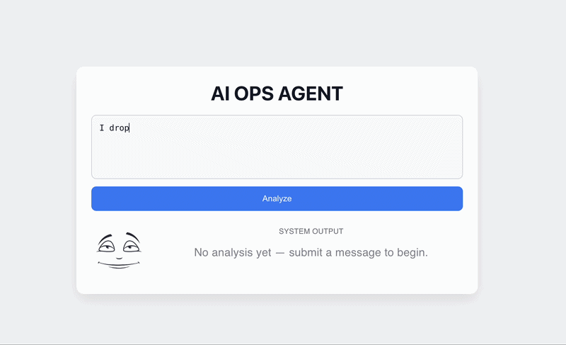

# AI Ops Agent

AI Ops Agent is a full-stack application that classifies incoming text messages using a large language model. It assigns a type, priority level, and generates a suggested response. The frontend provides a simple interface with real-time feedback and a visual status indicator.

---

## Features

- Classifies messages into: support, sales, bug, spam
- Assigns priority: low, medium, high
- Generates suggested response using OpenAI
- Real-time UI updates with loading state
- Visual indicator that changes based on system state

---

## Tech Stack

- React (Vite)
- Node.js
- Express
- OpenAI API
- Axios

---

## How It Works

1. User enters a message in the frontend
2. Frontend sends request to backend /analyze endpoint
3. Backend sends prompt to OpenAI API
4. Model returns structured JSON:
   - type
   - priority
   - response
5. Frontend renders result and updates UI

---

## Setup Instructions

### Clone the repository

```bash
git clone https://github.com/cto234/ai-ops-agent.git
cd ai-ops-agent
```

---

### Backend setup

```bash
cd server
npm install
```

Create a .env file in the server directory:

OPENAI_API_KEY=your_api_key_here

Start backend server:

```bash
node index.js
```

---

### Frontend setup

```bash
cd client
npm install
npm run dev
```

Frontend runs at:
http://localhost:5173

Backend runs at:
http://localhost:5001

---

## Demo



It demonstrates:
- Message input
- Loading state
- AI classification output
- Priority-based visual response

---

## Notes

- Never commit .env files
- Ensure backend is running before frontend requests
- OpenAI API key must have billing enabled

---

## Future Improvements

- Add conversation history
- Deploy full stack application
- Add authentication
- Improve classification accuracy
- Store logs in a database